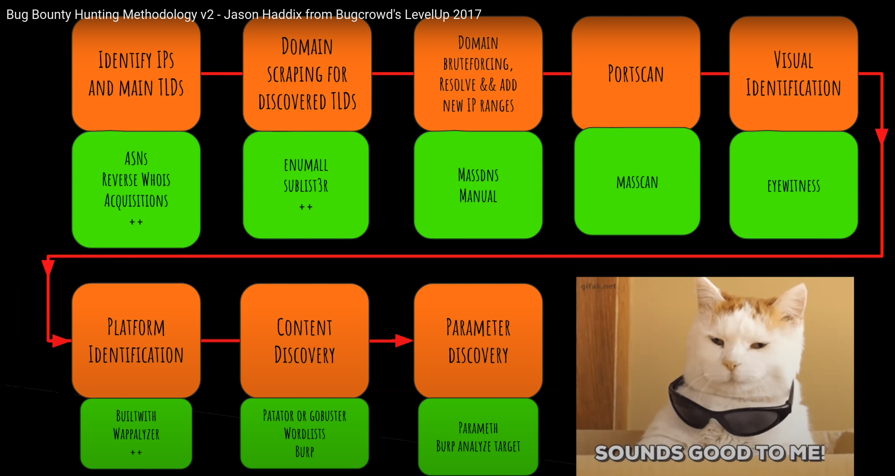
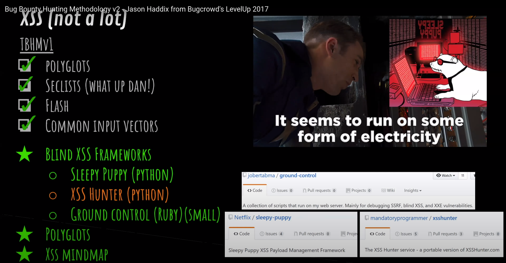

# Videoconferència

[https://www.youtube.com/watch?v=C4ZHAdI8o1w&feature=youtu.be&ab_channel=Bugcrowd](https://www.youtube.com/watch?v=C4ZHAdI8o1w&feature=youtu.be&ab_channel=Bugcrowd)

#  Discover : 

- Scrapping for subdomains  -> [Sublist3r](https://github.com/aboul3la/Sublist3r) 
- Enumall (Recon-ng , alt-dns wrapper) -> [Massdns](https://github.com/blechschmidt/massdns)

Tots els dominis per massdns : [https://gist.github.com/jhaddix/86a06c5dc309d08580a018c66354a056](https://gist.github.com/jhaddix/86a06c5dc309d08580a018c66354a056)

1.2M de subdominis. 

- NMAP Standard -> masscan

**Brutesubs** -> Eines en docker per la cerca de subdominis massiva.

- Update docker image
- .env file -> Adaptar al que creiem convenient. 
- Disable Bruteforce -> és molt lent. 

## Identificació visual: 

Donada una llista de dominis intenta fer foto de cada una de les webs que apareixen. Fa captures. Després podem anar anlitzant les fotos per descobrir coses i idees. 

- [EyeWitness](https://github.com/FortyNorthSecurity/EyeWitness)

Et posa els noms en funció de si son http o https.

## Identificació de la plataforma

- [Retire.js](https://retirejs.github.io/retire.js/)

Podem identificar els llenguatges de programació que hi ha redera i molta informació adicional.

## Entendre la app target.

## Content discovery

Donada una llista de possibles directoris (un diccionari) ens retorna els diferents endpoints d'un subdomini que responen als diferents recursos de la llista. 

- [gobuster](https://github.com/OJ/gobuster)

## Parameter bruting.

[https://github.com/maK-/parameth](https://github.com/maK-/parameth)

Donada una llista de noms de paràmetres (backslash scanners) es podria mirar si es pot aconseguir informació específica que estigui exposada. 

## Workflow: 



# XSS



Polyglot

- [Mapa xss de jackmasa](https://raw.githubusercontent.com/s0md3v/AwesomeXSS/master/Database/jackmasa-mind-map.png)

Podem fer servir el mapa per veure com fer servir el XSS

# Server side template Engine

Hem de preguntar-nos si la pàgina fa servir alguna Server side template engine. Per poder saber si podem fer algun tipus d'injecció.

- [Tplmap](https://github.com/epinna/tplmap)

POdem fer servir la eina anterior per detectar punts d'injecció en funció de la plantilla que estiguin fent servir. 

# Server side request forgery

Quan redirigim els resultats d'algun recurs des del servidor i li passem per paràmetre. 

```
http://google.com?url=http://loggedin.google.com
http://google.com?url=file:///etc/passwd
```

# Code injection.

- [commix]

# Backslash powered scanner 

Consisteix en escapar un ` o ' amb una contrabarra i per mirar si dona error o si no, en cas que amb la contrabarra no dongui error pot ser que es pugui afegir injecció mitjançant 'escapats. 